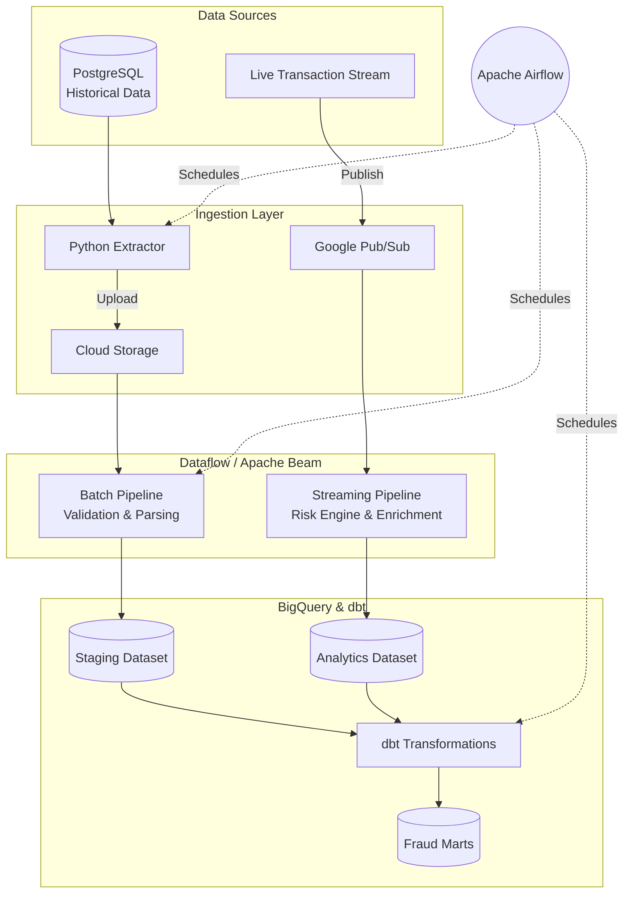

# 🚀 Financial Risk & Fraud Detection Data Platform

<p align="center">
  
  
  
  
  
  
  
  
</p>

A production-grade financial data engineering platform designed to process millions of transactions. This project simulates a real-world financial institution's data infrastructure. It ingests historical batch data from a PostgreSQL database, processes real-time transaction streams from Pub/Sub, scores transactions for fraud risk using Apache Beam, and models the output in Google BigQuery using dbt. 

Everything is orchestrated via Airflow and provisioned automatically using Terraform.

---

## 🏗️ System Architecture



---

## 📂 Repository Layout

```text
.
├── .github/workflows/         # CI/CD pipelines (Lint, Test, Deploy)
├── airflow/                   # Airflow runtime configuration
├── data/                      
│   ├── schemas/               # JSON Schema definitions for entities
│   └── generators/            # Python scripts for synthetic data generation
├── data_quality/              # Great Expectations validation suites
├── dbt/                       # Data Build Tool SQL models (staging, marts)
├── fraud/
│   ├── rules/                 # Fraud detection signal logic (velocity, location)
│   └── risk_scoring/          # Engine weighting signals into a 0-100 risk score
├── infrastructure/
│   ├── postgres/              # Local DB initialization (init.sql)
│   └── terraform/             # IaC to provision GCP resources (Buckets, BQ, IAM)
├── ingestion/                 # Extraction scripts (Postgres to GCS)
├── orchestration/dags/        # Airflow DAGs for orchestrating the platform
├── pipelines/                 # Apache Beam pipelines
│   ├── batch/                 # Historical data loading and validation
│   └── streaming/             # Real-time transaction scoring via Pub/Sub
├── tests/                     # Unit and integration test suites
└── setup.py                   # Packaging script for GCP Dataflow workers
```

---

## 🚀 Execution Guide

This platform is designed to run seamlessly on your local machine using simulated services, or fully deployed to the Google Cloud Platform. 

### 💻 Option 1: Local Development (DirectRunner)

Run the entire pipeline on your laptop without incurring cloud costs.

#### 1. Setup Environment
```bash
# Clone the repository & create a virtual environment
git clone https://github.com/iamdpsingh/Project-4-Financial-Risk-Fraud-Detection-Data-Platform.git
cd Project-4-Financial-Risk-Fraud-Detection-Data-Platform
python3 -m venv .venv
source .venv/bin/activate
pip install -r requirements.txt && pip install -e .
```

#### 2. Start Services & Generate Data
*Requires Docker Desktop.*
```bash
# Start Postgres & Pub/Sub Emulator
docker-compose up -d

# Initialize schema and generate synthetic data
docker exec -i postgres_db psql -U admin -d financial_risk < infrastructure/postgres/init.sql
python data/generators/generate_all.py
```

#### 3. Run Pipelines Locally
**Batch Pipeline:**
```bash
python ingestion/batch/extract.py --output data/raw
python pipelines/batch/pipeline.py --runner=DirectRunner --input_dir=data/raw --output_local
```

**Streaming Pipeline (Requires 2 terminal windows):**
```bash
# Terminal 1: Stream transactions to Pub/Sub
python data/generators/generate_streaming.py --pubsub

# Terminal 2: Process the stream through Apache Beam
python pipelines/streaming/pipeline.py --runner=DirectRunner
```

---

### ☁️ Option 2: Production on Google Cloud Platform

Deploy the infrastructure to GCP and run pipelines on managed Dataflow.

#### 1. Provision Infrastructure
Authenticate with your Google Cloud account and deploy the resources:
```bash
gcloud auth application-default login
cd infrastructure/terraform
terraform init
terraform apply -auto-approve
```

#### 2. Run Dataflow Pipelines
Instead of running locally, submit the jobs to Google Cloud Dataflow:
```bash
# Submit Batch Job
python pipelines/batch/run_dataflow.py

# Submit Streaming Job
python pipelines/streaming/run_dataflow.py
```

#### 3. Airflow Orchestration
Start the Airflow scheduler to automate the batch pipeline daily:
```bash
export AIRFLOW_HOME=$(pwd)/airflow
airflow db init
airflow standalone
```
*Access the Airflow UI at `http://localhost:8080` to toggle the `batch_ingestion_pipeline` DAG.*
