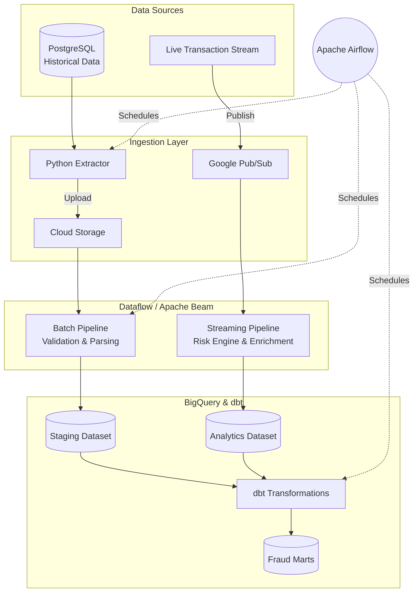

# 🚀 Financial Risk & Fraud Detection Data Platform

<p align="center">
  
  
  
  
  
  
  
  
</p>

A production-grade financial data engineering platform designed to process millions of transactions. This project simulates a real-world financial institution's data infrastructure. It ingests historical batch data from a PostgreSQL database, processes real-time transaction streams from Pub/Sub, scores transactions for fraud risk using Apache Beam, and models the output in Google BigQuery using dbt. 

Everything is orchestrated via Airflow and provisioned automatically using Terraform.

---

## 🏗️ System Architecture



---

## 📂 Repository Layout

```text
.
├── .github/workflows/         # CI/CD pipelines (Lint, Test, Deploy)
├── airflow/                   # Airflow runtime configuration
├── data/                      
│   ├── schemas/               # JSON Schema definitions for entities
│   └── generators/            # Python scripts for synthetic data generation
├── data_quality/              # Great Expectations validation suites
├── dbt/                       # Data Build Tool SQL models (staging, marts)
├── fraud/
│   ├── rules/                 # Fraud detection signal logic (velocity, location)
│   └── risk_scoring/          # Engine weighting signals into a 0-100 risk score
├── infrastructure/
│   ├── postgres/              # Local DB initialization (init.sql)
│   └── terraform/             # IaC to provision GCP resources (Buckets, BQ, IAM)
├── ingestion/                 # Extraction scripts (Postgres to GCS)
├── orchestration/dags/        # Airflow DAGs for orchestrating the platform
├── pipelines/                 # Apache Beam pipelines
│   ├── batch/                 # Historical data loading and validation
│   └── streaming/             # Real-time transaction scoring via Pub/Sub
├── tests/                     # Unit and integration test suites
└── setup.py                   # Packaging script for GCP Dataflow workers
```

---

## 🚀 Execution Guide

This platform is designed to run seamlessly on your local machine using simulated services, or fully deployed to the Google Cloud Platform. 

### 💻 Option 1: Local Development (DirectRunner)

Run the entire pipeline on your laptop without incurring cloud costs.

#### 1. Setup Environment
```bash
# Clone the repository & create a virtual environment
git clone https://github.com/iamdpsingh/Project-4-Financial-Risk-Fraud-Detection-Data-Platform.git
cd Project-4-Financial-Risk-Fraud-Detection-Data-Platform
python3 -m venv .venv
source .venv/bin/activate
pip install -r requirements.txt && pip install -e .
```
**Why do we do this?** We use a Python virtual environment (`.venv`) to isolate our project's dependencies from your system's global Python. This ensures that the exact versions of Apache Beam, Airflow, and Pandas we need don't conflict with other projects on your Mac.

#### 2. Start Services & Generate Data
*Requires Docker Desktop.*
```bash
# Start Postgres & Pub/Sub Emulator
docker-compose up -d

# Initialize schema and generate synthetic data
docker exec -i postgres_db psql -U admin -d financial_risk < infrastructure/postgres/init.sql
python data/generators/generate_all.py
```
**Why do we do this?** A real data platform needs data sources to read from. `docker-compose up -d` starts a local PostgreSQL database (to act as our source of truth for historical data) and a Pub/Sub emulator (to act as our message broker for live streams). The `generate_all.py` script then fills the database with thousands of realistic, synthetic customers and transactions so we have data to process.

#### 3. Run Pipelines Locally
**Batch Pipeline:**
```bash
python ingestion/batch/extract.py --output data/raw
python pipelines/batch/pipeline.py --runner=DirectRunner --input_dir=data/raw --output_local
```
**Why do we do this?** In a batch architecture, data is processed in chunks. First, `extract.py` simulates a nightly job pulling the latest records from the Postgres database and saving them as CSVs. Then, the batch `pipeline.py` uses Apache Beam's `DirectRunner` (a local execution engine) to parse the CSVs, validate the data types, and prepare it for analytics.

**Streaming Pipeline (Requires 2 terminal windows):**
```bash
# Terminal 1: Stream transactions to Pub/Sub
source .venv/bin/activate
python data/generators/generate_streaming.py --pubsub

# Terminal 2: Process the stream through Apache Beam
source .venv/bin/activate
python pipelines/streaming/pipeline.py --runner=DirectRunner
```
**Why do we do this?** Streaming architecture handles data continuously. Terminal 1 runs a script that acts like a live API, firing hundreds of transactions per second into our Pub/Sub broker. Terminal 2 runs the Apache Beam streaming pipeline which instantly consumes those messages, applies the fraud scoring rules, and flags suspicious transactions in real time.

---

### ☁️ Option 2: Production on Google Cloud Platform

Deploy the infrastructure to GCP and run pipelines on managed Dataflow.

#### 1. Provision Infrastructure
Authenticate with your Google Cloud account and deploy the resources:
```bash
gcloud auth application-default login
cd infrastructure/terraform
terraform init
terraform apply -auto-approve
```
**Why do we do this?** Instead of clicking around the GCP Console manually, we use Terraform (Infrastructure as Code) to automatically and predictably create our Cloud Storage buckets, BigQuery datasets, and Service Accounts exactly as they are configured in the code.

#### 2. Run Dataflow Pipelines
Instead of running locally, submit the jobs to Google Cloud Dataflow:
```bash
# Submit Batch Job
python pipelines/batch/run_dataflow.py

# Submit Streaming Job
python pipelines/streaming/run_dataflow.py
```
**Why do we do this?** The `run_dataflow.py` scripts take our exact same Apache Beam Python code but tell Google Cloud Dataflow to run it. Dataflow automatically spins up clusters of servers (workers) in the cloud to process massive amounts of data in parallel, which a single laptop couldn't handle.

#### 3. Airflow Orchestration
Start the Airflow scheduler to automate the batch pipeline daily:
```bash
export AIRFLOW_HOME=$(pwd)/airflow
airflow db init
airflow standalone
```
*Access the Airflow UI at `http://localhost:8080` to toggle the `batch_ingestion_pipeline` DAG.*

**Why do we do this?** Data pipelines need to run on a schedule (e.g., every midnight). Apache Airflow is an orchestrator that manages this schedule. The DAG (Directed Acyclic Graph) we wrote tells Airflow: "First run the extraction, then upload to Cloud Storage, and finally trigger the Dataflow job — and only proceed if the previous step succeeds."
