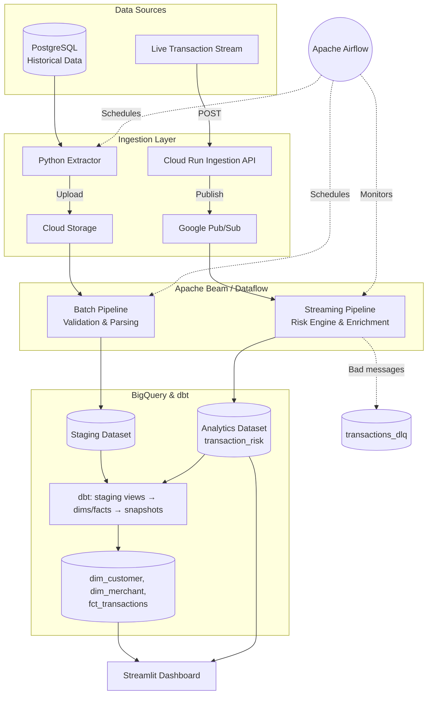

<div align="center">
  
# 🛡️ Enterprise Financial Risk & Fraud Detection Platform
**A Production-Grade, Real-Time Data Engineering Architecture**

[](https://www.python.org/)
[](https://beam.apache.org/)
[](https://cloud.google.com/bigquery)
[](https://cloud.google.com/pubsub)
<br>
[](https://airflow.apache.org/)
[](https://www.terraform.io/)
[](https://www.getdbt.com/)
[](https://www.docker.com/)

An end-to-end cloud data platform capable of processing **millions of synthetic banking transactions** through both batch and sub-second streaming pipelines. Built natively on GCP with industry best practices for IaC, orchestration, and CI/CD.

</div>

---

## 🚀 Platform Overview

This repository demonstrates a complete Lambda architecture for financial operations:
1. **Batch Ingestion:** Extracts millions of historical database records into Cloud Storage, validates them via Apache Beam/Dataflow, and loads them into BigQuery.
2. **Real-Time Fraud Radar:** Ingests live card swipes through a FastAPI Cloud Run endpoint into Pub/Sub, processes them through a streaming Dataflow risk engine, and surfaces them instantly on a Streamlit dashboard.
3. **Automated Analytics:** Uses `dbt` to model raw data into an optimized dimensional star schema for downstream BI tools.
4. **Cloud Native:** Fully orchestrated by Apache Airflow, deployed via GitHub Actions CI/CD, and provisioned identically across environments using Terraform.

---

## 🏗️ System Architecture



---

## 🧠 Real-Time Fraud Engine

The heart of the streaming pipeline is a dynamic rules engine that evaluates live transactions in sub-second time. Each transaction triggers a series of behavioral heuristics to generate a unified 0-100 risk score:

| Signal | Weight | Detection Logic |
|---|---|---|
| **High Velocity** | 25% | >3 Standard deviations above 30-day average transaction amount |
| **New Device** | 20% | Transaction originating from an unseen or unlinked user device |
| **Impossible Travel** | 20% | Geo-velocity threshold breached (e.g. NYC to London in < 1 hr) |
| **Velocity Burst** | 15% | High frequency of rapid-fire transactions within a 10-minute window |
| **Failure Chain** | 10% | Multiple successive auth declines preceding a successful transaction |
| **Risky Merchant** | 10% | Merchant categorized in high-risk sectors (e.g., offshore crypto, gambling) |
| **Off-Hours** | 5% | Activity detected during deep off-hours (2:00 AM - 5:00 AM local time) |

🔴 **HIGH RISK (71-100):** Auto-blocked & alerted.  
🟡 **MEDIUM RISK (31-70):** Flagged for 2FA/Step-up auth.  
🟢 **LOW RISK (0-30):** Frictionless approval.  

---

## 💻 Quickstart: Local Execution

Want to run the entire distributed architecture locally? You can use Apache Beam's `DirectRunner` and Docker Compose.

### 1. Environment Setup
```bash
git clone https://github.com/iamdpsingh/Project-4-Financial-Risk-Fraud-Detection-Data-Platform.git
cd Project-4-Financial-Risk-Fraud-Detection-Data-Platform

python3 -m venv .venv && source .venv/bin/activate
pip install -r requirements.txt && pip install -e .
cp .env.example .env
```

### 2. Stand up Infrastructure & Generate Data
Spin up local PostgreSQL and a Pub/Sub emulator, then generate 2.5 million records of synthetic data:
```bash
docker compose up -d
docker exec -i frp_postgres psql -U fraud_user -d financial_risk < infrastructure/postgres/init.sql

PYTHONPATH=. python data/generators/generate_all.py
```

### 3. Run the Pipelines
**Batch Pipeline** (Historical loads):
```bash
PYTHONPATH=. python ingestion/batch/extract.py --output data/raw
PYTHONPATH=. python pipelines/batch/pipeline.py --runner=DirectRunner --input_dir=data/raw --output_local
```

**Streaming Pipeline** (Run these in two separate terminal windows):
```bash
# Terminal A: Start the real-time telemetry generator
source .venv/bin/activate
PYTHONPATH=. python data/generators/generate_streaming.py --pubsub

# Terminal B: Start the Apache Beam streaming processor
source .venv/bin/activate
PYTHONPATH=. python pipelines/streaming/pipeline.py --runner=DirectRunner
```

### 4. Launch the Command Center
Watch the fraud engine detect threats in real-time on the Streamlit dashboard:
```bash
streamlit run dashboard/app.py
```

---

## ☁️ Deployment: Google Cloud Platform

To deploy the production-grade architecture to GCP via Terraform and Dataflow:

**1. Provision IaC (Terraform)**
```bash
gcloud auth application-default login
cd infrastructure/terraform
terraform init
terraform apply -var="project_id=YOUR_PROJECT_ID"
```

**2. Deploy Ingestion API (Cloud Run)**
```bash
cp cloud_run/Dockerfile .
gcloud builds submit --tag us-central1-docker.pkg.dev/YOUR_PROJECT_ID/fraud-repo/transaction-api:latest .
gcloud run deploy transaction-api --image=us-central1-docker.pkg.dev/YOUR_PROJECT_ID/fraud-repo/transaction-api:latest --region=us-central1 --allow-unauthenticated
rm Dockerfile
```

**3. Launch Dataflow Jobs**
```bash
PYTHONPATH=. python pipelines/batch/run_dataflow.py
PYTHONPATH=. python pipelines/streaming/run_dataflow.py
```

**4. Execute Analytics Modeling (dbt)**
```bash
cd dbt
dbt run --vars '{"project_id": "YOUR_PROJECT_ID"}'
```

---

## 📂 Repository Structure

```text
├── .github/workflows/ci-cd.yml      # GitHub Actions CI/CD Pipeline
├── cloud_run/                       # FastAPI high-throughput ingestion endpoint
├── dashboard/                       # Real-time Streamlit Command Center
├── data/                            # Advanced synthetic data & fraud scenario generators
├── dbt/                             # BigQuery dimensional modeling & snapshotting
├── docs/                            # Comprehensive architectural design specs
├── fraud/                           # Core risk scoring engine & behavioral heuristics
├── infrastructure/                  # Terraform IaC & Local Docker specs
├── ingestion/                       # PostgreSQL extraction & GCS bulk uploading
├── pipelines/                       # Apache Beam pipelines (Batch & Streaming)
└── tests/                           # Unit tests (pytest) & Data Quality assertions
```

---

## 🛠️ CI/CD & Development Checks

This project enforces strict code quality via GitHub Actions. Before pushing, ensure your code passes locally:

```bash
# 1. Format & Lint
ruff format .
ruff check . --fix

# 2. Type Check
mypy . --ignore-missing-imports

# 3. Unit Tests
pytest tests/unit/ -v

# 4. Terraform Validate
cd infrastructure/terraform
terraform fmt -recursive
terraform validate
```

---

<div align="center">
  <i>Architected for scale. Designed for security. Built for production.</i>
</div>